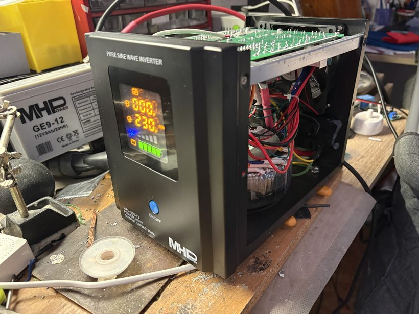
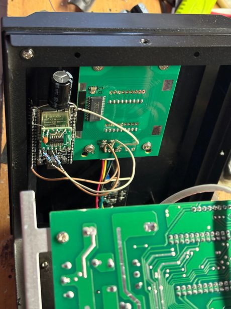
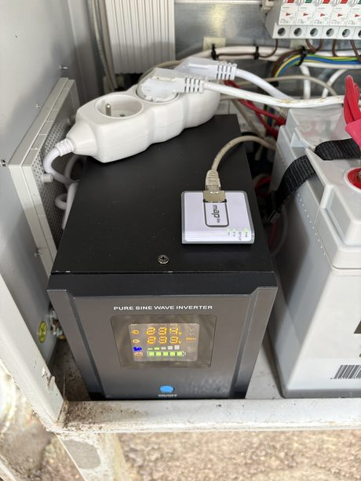

# MHpower UPS monitor (ESP32)

Monitoring zálohovaných zdrojů **MHpower (MPU‑500 a příbuzné)** pomocí ESP32. Firmware
**pasivně odposlouchává sběrnici displeje (TM1640)**, dekóduje z ní vstupní/výstupní napětí,
stav sítě/baterie, zátěž a alarmy — a publikuje je přes **webové rozhraní** a **SNMP**.
Do zdroje se nijak nezasahuje — jen se „čte přes rameno“ jeho vlastní displej.

> Vstupní/výstupní data čte z displeje, takže přesnost je omezená rozlišením displeje
> (napětí po celých voltech, zátěž a baterie v 6 dílcích). Cílem je spolehlivý přehled
> a alarmy, ne laboratorní přesnost.

<p align="center">
  
  <br><sub><i>Hotová zástavba: MHpower MPU s ESP32, který „čte přes rameno“ jeho displej (zde výstup 230 V, baterie plná). Další fotky v <a href="docs/foto-realizace/">galerii provedení</a>.</i></sub>
</p>

---

## Obsah
- [Jak to funguje](#jak-to-funguje)
- [Funkce](#funkce)
- [Hardware a zapojení](#hardware-a-zapojení)
- [Sestavení a nahrání](#sestavení-a-nahrání)
- [První konfigurace](#první-konfigurace)
- [Webové rozhraní](#webové-rozhraní)
- [Výpočet výdrže baterie](#výpočet-výdrže-baterie)
- [SNMP](#snmp)
- [Diagnostika výpadků](#diagnostika-výpadků)
- [Úspora odběru](#úspora-odběru)
- [Struktura repozitáře](#struktura-repozitáře)
- [Historie vývoje](#historie-vývoje)

---

## Jak to funguje

Displej MHpoweru řídí budič **TM1640** po dvouvodičové sériové sběrnici (CLK + DIN).
ESP32 se na tyto dvě linky připojí jako **pasivní posluchač** a v těsné smyčce
(s vypnutými přerušeními) navzorkuje GPIO. Z navzorkovaných hran pak softwarově
zrekonstruuje TM1640 rámec.

**Reálný signál** (ověřeno logickým analyzátorem): hodiny ~500 kHz, jeden rámec trvá
~192 µs a posílá se zhruba **2× za sekundu**.

**Formát rámce** (po dekódování bajtů):

```
0x40  0xC0  [10 bajtů paměti displeje]  0x88|jas
 │     │     └─ mem[0..9]                └─ příkaz jasu (0x8X)
 │     └─ nastav adresu 0
 └─ zápis dat, autoinkrement adresy
```

Mapování paměti displeje na zobrazené hodnoty:

| bajt | význam |
|------|--------|
| `mem[0..2]` | vstupní napětí — 3 číslice (7‑segment) |
| `mem[3..5]` | výstupní napětí — 3 číslice |
| `mem[6]`    | režim / ikony (síť, běh na baterii, přehřátí) |
| `mem[7]`    | úroveň zátěže (0–5 dílků / přetížení) |
| `mem[8]`    | ikony |
| `mem[9]`    | dílky baterie (0–5) |

Dekodér si nevynucuje konkrétní polaritu/pořadí — **brute‑force** vyzkouší varianty
(náběžná/sestupná hrana, LSB/MSB, inverze, fázový posun) a vybere tu, která dá platný
rámec se smysluplnými hodnotami. Díky tomu je odolný vůči záměně CLK/DIN i invertujícímu
děliči.

---

## Funkce

- **Pasivní čtení** displeje MHpower přes TM1640 (žádný zásah do zdroje).
- **Webový dashboard** (auto‑refresh): vstup/výstup, síť/baterie, zátěž, výkon, alarmy,
  výdrž na baterii, kondice baterie.
- **Dvě úrovně přístupu** — správce (`admin`) vidí a mění vše, host (`guest`/`guest`) jen čte;
  tlačítko **„odhlásit“** pro přepnutí uživatele.
- **Přepětí / podpětí (V↑ / V↓, AVR)** odvozené z dekódovaného vstupního napětí; podpora
  **24 V / 48 V** baterií a **14 modelů MPU** (300–5000 W, napětí baterie se zvolí automaticky).
- **Odhad výdrže** s učením energie na jednotlivé dílky baterie (viz níže) — a **proaktivně i na síti**
  („kdyby teď vypadl proud, vydrží ~X“).
- **SNMP v1** (UDP/161) — 50 OID pro integraci do monitoringu (Zabbix, LibreNMS, …).
- **OTA aktualizace** firmwaru přes web (s progress barem).
- **Diagnostika běhu** — důvod posledního restartu, uptime, heap, fragmentace, TX výkon,
  takt CPU (kvůli ladění výpadků bez sériáku).
- **Log událostí** — kruhový log (výpadky sítě, baterie, alarmy) s NTP časem, `/api/events` i ve webu.
- **WiFi dohled** — aktivní reconnect; když se WiFi nepřipojí (do 15 s po startu nebo po 1 min výpadku),
  nahodí se **záchranný hotspot** (`MHpower-XXXX`, WPA2 heslo `mhpower-setup`, web na `http://192.168.4.1`),
  přes který se opraví špatně zadaná WiFi; po obnově spojení se hotspot sám vypne. **Task watchdog** proti zaseknutí
  (a po 10 min bez spojení a bez klienta na hotspotu tvrdý reboot jako poslední pojistka).
- **mDNS** — dostupné na `http://<název>.local` bez znalosti IP.
- **Úsporný režim** — **nastavitelný** WiFi výkon (výchozí 5 dBm), WiFi modem‑sleep, CPU 160 MHz, vypnutý Bluetooth,
  throttle snímání (nesnímá naplno pořád).

---

## Hardware a zapojení

- **ESP32** (DevKit / WROOM).
- Displej MHpower s budičem **TM1640** (sběrnice běží na 5 V).
- **74LVC14A** — hex Schmittův invertor jako oddělovací buffer (napájený z **3,3 V**).

Sběrnice se nepřipojuje přímo ani přes pouhý dělič, ale přes **Schmittův invertor 74LVC14A**.
Ten dělá dvě věci najednou: **level‑shift 5 V → 3,3 V** (vstupy LVC jsou 5V‑tolerantní, čip
napájený z 3V3 dává na výstupu bezpečnou 3,3V logiku) a **vyčistí hrany hysterezí** (klíčové
u dlouhých/rušených vodičů — zašuměné hrany byly příčina dřívějšího nespolehlivého čtení).

| signál | cesta |
|--------|-------|
| TM1640 **CLK** | → 1 kΩ → 74LVC14 **pin 1 (1A)**; **pin 2 (1Y)** → 100 Ω → ESP32 **GPIO18** |
| TM1640 **DIN** | → 1 kΩ → 74LVC14 **pin 3 (2A)**; **pin 4 (2Y)** → 100 Ω → ESP32 **GPIO23** |
| napájení | 74LVC14 **pin 14 (VCC)** → ESP32 **3V3**; **pin 7 (GND)** → GND; blokovací **100 nF** VCC–GND |
| zem | společná: GND displeje + ESP32 + pin 7 |

> Použita jsou jen **2 hradla ze 6**, zbylé vstupy klidně uzemni. Signály vyjdou z invertoru
> **invertované** — nevadí, firmware si polaritu (edge + invert) při dekódování najde sám.
> Napájení displeje zůstává **5 V**, mění se jen úroveň datových linek.

Schémata: [`docs/zapojeni_spravne.png`](docs/zapojeni_spravne.png) (celé zapojení),
[`docs/zapojeni_chip.png`](docs/zapojeni_chip.png) (detail pinů 74LVC14).

<p align="center">
  
  &nbsp;&nbsp;
  
  <br><sub><i>Vlevo: ESP32 na desce displeje (TM1640) přes Schmittův invertor 74LVC14A. Vpravo: instalace v rozvaděči (brána MikroTik mAP). Celá <a href="docs/foto-realizace/">galerie provedení</a>.</i></sub>
</p>

---

## Sestavení a nahrání

Závislosti: **arduino‑esp32** (testováno na core 2.0.x i 3.x), standardní knihovny
(`WiFi`, `WebServer`, `WiFiUdp`, `Update`, `Preferences`).

### Arduino IDE
1. Otevři `firmware/mhpower_esp32_capture/mhpower_esp32_capture.ino`.
2. Vyber svou ESP32 desku a **Partition Scheme s OTA** (výchozí „4MB with spiffs“ stačí).
3. **Sketch → Export Compiled Binary** → vznikne `…ino.bin` vedle sketche.

### arduino‑cli
```bash
arduino-cli core install esp32:esp32
arduino-cli compile --fqbn esp32:esp32:esp32 -e firmware/mhpower_esp32_capture
# výsledek: build/esp32.esp32.esp32/mhpower_esp32_capture.ino.bin
```

### Nahrání (OTA)
Ve webu **systém → Firmware a údržba → Nahrát firmware** vyber **aplikační** image
`mhpower_esp32_capture.ino.bin` (ne `.merged.bin`/`.bootloader.bin`/`.partitions.bin`).
Průběh ukáže progress bar; po dokončení se ESP32 sám restartuje.

První nahrání (bez OTA) udělej přes USB klasicky z IDE / `arduino-cli upload`.

---

## První konfigurace

V repo verzi jsou přihlašovací údaje jen **placeholdery** — nastav je před prvním flashem
v `struct AppSettings`:

```cpp
char wifiSsid[33] = "WIFI_SSID";       // tvoje WiFi
char wifiPass[65] = "WIFI_PASSWORD";
char webPass[33]  = "changeme";        // heslo do webu (uživatel "admin")
```

Po připojení už jde vše měnit ve webu (**systém**) a ukládá se do flash (NVS) —
hodnoty v kódu slouží jen jako výchozí při čistém zařízení.

Vedle správce (`admin`) je ve firmwaru napevno účet **`guest` / `guest`** pro **jen čtení**
(vidí hodnoty, nic nezmění). Heslo správce se mění ve webu, guest je fixní.

---

## Webové rozhraní

- `/` — **monitor** (dlaždice, auto‑refresh přes `/api/status`).
- `/settings` — **systém** (jen správce): pojmenování, **přístup** (web login správce, SNMP community,
  **NTP server**), **WiFi v samostatné sekci** (SSID + heslo — změna se projeví **až po restartu**
  zařízení — a **vysílací výkon**, který se naopak projeví **ihned**), typ zdroje (14 modelů MPU 300–5000 W, napětí baterie 12/24/48 V se nastaví automaticky),
  kapacita a datum instalace baterie, minimální výdrž, práh kondice; sekce **Rozhraní (API)**, OTA a restart.

**Přihlášení (HTTP Basic auth) — dvě úrovně:**

- **správce** — uživatel `admin` (heslo z nastavení): vidí a mění vše.
- **host** — napevno **`guest` / `guest`**: **jen čtení** (dashboard, `/api/status`, `/api/events`),
  nic nezmění. V dashboardu se mu skryje odkaz „systém“ a ukáže odznak „jen čtení (host)“.

Odkaz **„odhlásit“** (v hlavičce monitoru i v systému) zahodí uložené přihlášení v prohlížeči
(přes `/logout`, který vrátí 401) — lze se tak přepnout mezi `admin` a `guest`.

**API endpointy:**

- `/api/status` — JSON se všemi hodnotami (+ pole `isAdmin`); čte host i správce.
- `/api/events` — JSON posledních událostí; čte host i správce.
- `/api/digitscan`, `/api/iconscan` — textové vývojové skeny displeje (jen správce).

Dlaždice **Diagnostika** ukazuje:
`rámců N / heap (min, blok) / err / filtr / cap / tout | běh / reset: … / TX … dBm / CPU … MHz / dílky x/5`.

| pole | význam |
|------|--------|
| `err` | rámce, které selhaly při dekódování |
| `filtr` | rámce zahozené jako nesmyslné (sanity filtr) |
| `cap` / `tout` | úspěšné navzorkování / timeout (sběrnice byla v klidu) |
| `běh` | uptime od startu |
| `reset:` | důvod posledního restartu |
| `dílky x/5` | kolik dílků baterie už má naučenou energii |

---

## Výpočet výdrže baterie

Odhad zbývající výdrže běží ve dvou vrstvách:

**1) Prior (vždy k dispozici)** — z kapacity v Ah:
```
využitelná Wh = Ah × 12 V × 0,85 × kondice
reálný odběr  = výstupní výkon / účinnost měniče + klidová spotřeba měniče
kapacita      = korigovaná Peukertem podle vybíjecího proudu (k = 1,15, C20)
```
plus učení kondice z plných výbojů (EMA) a klouzavý průměr odběru pro stabilní odhad.
Účinnost měniče (0,85) a klidová spotřeba (20 W) jsou napevno v kódu
(`INVERTER_EFFICIENCY` / `INVERTER_IDLE_W`), ne v nastavení.

**2) Ukotvení na dílky (přesnější, učí se za běhu)** — měnič sám zná reálné napětí, proud
i teplotu a jeho výsledkem jsou **dílky baterie**. Firmware měří, **kolik reálné energie
[Wh] se spotřebuje na každý dílek**, a učí si tabulku Wh/dílek (EMA, ukládá do flash).
Výdrž = (zbytek aktuálního dílku + naučené spodní dílky) / odběr. Peukert i účinnost jsou
v tom měření už přirozeně zahrnuté.

> Bezpečné chování: dokud nejsou naučené **≥ 3 dílky**, jede prior (Ah+Peukert). Tabulka
> se maže při změně kapacity nebo data instalace baterie (= nová baterie).

---

## SNMP

SNMP **v1**, UDP **161**, community dle nastavení (výchozí `public`).
Base OID: **`1.3.6.1.4.1.53864.1.1`**, dotazuj se `…1.1.<index>.0` (GET i GETNEXT/walk).

| idx | typ | hodnota | idx | typ | hodnota |
|----:|-----|---------|----:|-----|---------|
| 1 | str | název zařízení | 20 | int | chyby dekódování |
| 2 | int | online (1/0) | 21 | int | filtrované rámce |
| 3 | int | vstupní napětí [V] | 22 | int | capture timeouty |
| 4 | int | výstupní napětí [V] | 23 | int | typ zdroje [W] |
| 5 | int | frekvence [Hz] | 24 | int | kapacita baterie [Ah×10] |
| 6 | int | síť přítomna (1/0) | 25 | int | kondice baterie [%] |
| 7 | int | běh na baterii (1/0) | 26 | int | běh na baterii [s] |
| 8 | str | stav zdroje | 27 | int | zbývající výdrž [s] |
| 9 | int | alarm (1/0) | 28 | int | poslední běh na baterii [s] |
| 10 | int | přehřátí (1/0) | 29 | str | IP adresa |
| 11 | int | zátěž [%] | 30 | str | syrová paměť displeje (hex) |
| 12 | int | odhad výkonu [W] | 31 | int | nabíjení (1/0) |
| 13 | int | úroveň zátěže (0–5) | 32 | int | kritická baterie (1/0) |
| 14 | int | přetížení (1/0) | 33 | int | nízká baterie (1/0) |
| 15 | int | dílky baterie (0–5) | 34 | int | baterie plná (1/0) |
| 16 | str | stav baterie | 35 | int | odhad napětí baterie [V×10] |
| 17 | int | WiFi RSSI [dBm] | 36 | int | stáří posledního rámce [ms] |
| 18 | int | volný heap [B] | 37 | int | varování kondice (1/0) |
| 19 | int | počet rámců | 38 | int | varování výdrže (1/0) |

Diagnostické OID (39–44): **39** uptime [s], **40** min volný heap [B], **41** největší volný blok [B],
**42** (str) důvod restartu, **43** WiFi TX výkon [dBm×10], **44** takt CPU [MHz].

Identifikace desky: **45** (str) HW ID = MAC desky (`AA:BB:CC:DD:EE:FF`) — trvalý otisk, nemění se reflashem ani smazáním nastavení; slouží k odlišení více kusů v jednom racku.

Síť a výdrž: **46** přepětí (1/0), **47** podpětí (1/0), **48** (str) stav AVR (síť v normě / V↑ / V↓),
**49** proaktivní odhad výdrže [s] (i na síti = „kdyby teď vypadl proud“).

Verze: **50** (str) verze firmwaru (od v1.21; power monitor ji zobrazuje v detailu zdroje).

Příklad: `snmpwalk -v1 -c public <IP> 1.3.6.1.4.1.53864.1.1`

---

## Diagnostika výpadků

Zařízení nemá sériovou konzoli připojenou trvale, proto se diagnostika ukazuje ve webu.
Klíčové je pole **`reset:`** (z `esp_reset_reason()`):

| hodnota | příčina | co s tím |
|---------|---------|----------|
| `brownout` | propad napájení (proudová špička WiFi) | pevnější zdroj/kondenzátor; nižší TX výkon |
| `task-watchdog` / `int-watchdog` | smyčka nepustila systém | řešeno `delay(1)`/`yield()` ve smyčce |
| `panika/exception` | pád kódu | poslat výpis přes USB sériák |
| `power-on` | normální zapnutí | — |

`běh` (uptime) odliší restart (skočí na 0) od pouhého výpadku WiFi (uptime běží dál).
`minFreeHeap` a `maxAllocHeap` odhalí únik paměti / fragmentaci.

**Samoléčení:** WiFi se aktivně hlídá — po 15 s bez spojení se zkusí reconnect, po 1 min bez
WiFi naskočí **záchranný hotspot** (reconnect běží dál na pozadí), a po 10 min bez spojení
a bez klienta na hotspotu přijde tvrdý restart. **Task watchdog** (15 s) provede čistý reboot,
kdyby se smyčka zasekla. Přehled posledních událostí (výpadky sítě, běhy na baterii, alarmy) je v sekci
**Poslední události** na monitoru a strojově na `/api/events` (s NTP časem, pokud je synchronizovaný).

---

## Úspora odběru

Nakonfigurováno v kódu:

- **WiFi TX výkon** výchozí 5 dBm (**nastavitelný ve webu**, sekce Wi-Fi — `settings.wifiTxQdbm`) —
  AP bývá hned u ESP, takže nízký výkon neovlivní dosah, ale sníží proudové špičky i odběr.
- **WiFi modem‑sleep** (`WIFI_PS_MIN_MODEM`) — rádio spí mezi beacony.
- **CPU 160 MHz** místo 240 MHz (`setCpuFrequencyMhz(160)`).
- **Bluetooth vypnutý** (`btStop()`).

Aktuální TX výkon a takt CPU vidíš v dlaždici Diagnostika.

---

## Struktura repozitáře

```
firmware/
  mhpower_esp32_capture/   hlavní firmware (web + SNMP + OTA + baterie + diagnostika)
  mhpower_diag/            samostatný sériový diagnostický skeč sběrnice TM1640
  legacy/mhpower_wemos/    starší varianta (Wemos/ESP8266)
docs/                      schémata zapojení + historie vývoje (docs/HISTORIE.md)
docs/foto-realizace/       fotky skutečného provedení (zástavba ESP + instalace)
tools/                     generátory schémat + dekodéry sigrok záznamů (viz tools/README.md)
tools/captures/            ukázkové záznamy sběrnice (.sr) + vysvětlení
```

---

## Historie vývoje

Jak projekt vznikal — reverse engineering displeje logickým analyzátorem, tři pokusy o hardware
(Wemos → ATmega2560 → ESP32), odvození mapy displeje, boj se čtením sběrnice na ESP32 a finální
odrušení Schmittovým invertorem — je sepsáno v [`docs/HISTORIE.md`](docs/HISTORIE.md).
Obsahuje i přehled milníků verzí v1.0–v1.19.

---

## Nástroje

Viz [`tools/README.md`](tools/README.md) — Python skripty pro dekódování sigrok (`.sr`)
záznamů sběrnice TM1640 a pro generování schémat zapojení.

---

## Autor

Pavel Vlček, hkfree.org. Firmware pro vlastní potřebu monitoringu MHpower zdrojů.
